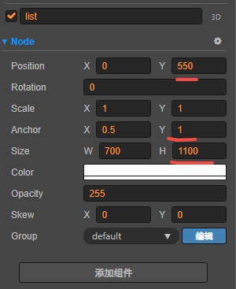
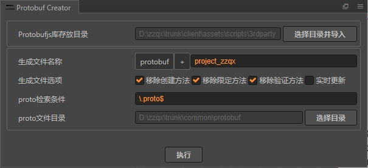

[配置相关](#配置相关)  
[模块相关](#模块相关)  

掌笑进度管理  {h}https://rcnjzu7kbluf.feishu.cn/base/ZNjIbgCluagSS4slYHPc049ynBf?table=tblP6NXYj6KkQYMg&view=vewWoMs3g6{!h}

buglist:  
{h}https://rcnjzu7kbluf.feishu.cn/wiki/SsgCwiudkiEOQbkicsmcJe8CnXg{!h}  


{r}todo:{!r}  
1.纹理透明通道  
2.自动化编译指定配置  
3.如何不生成hash资源?  
4.生成变量界面  
5.tabcontrol控制器实现  

    +---------------+
    |   项目相关    |
    +---------------+

    svn://svn.pahahaha.com/zhangxiao/zzqx 
    jw   jw@3324


自动图集  
`zzqx\trunk\client\assets\bundles\common\plist\kuang`  

文档:`zzqx\trunk\client\assets\bundles\bgs`背景色  

如果编辑报错:`删除项目library local temp文件夹`   

{file}doc/loadResource.ts{!file}


协议定义:`D:\zzqx\trunk\common\protobuf`

修改为外网
```ts
class serverDataBase {
    static WS: string = "wss";
    //...
}
export enum PLATFORM_ID {
    SY_H5_GAME = 1002,//H5 web
}

var urlList = {
    //开发服
    testSrvList: "https://zzqx-test.wanhuir.com/server/list",
```


指定服登录

http://localhost:7456/?url=ws://zx-kr-server.pahahaha.com:13208&disableGuide=1&debug=1&user=a2324

http://localhost:7456?srvList=https://zzqx-test.wanhuir.com/server/list


线上服链接{h}http://localhost:7456/?srvList=https://zzqx-test.wanhuir.com/server/list&ws=wss&platformId=1002{!h}  

http://localhost:7456/?url=ws://zx-kr-server.pahahaha.com:13208&disableGuide=1&debug=1&user=1111111111  
http://localhost:7456/?url=ws://zx-kr-server.pahahaha.com:13208&disableGuide=1&debug=1&user=ak001  

# 配置相关

错误码 errorcode  

通用配置 configuration  

武器 weapon  


    +----------------------+
    |       功能相关        |
    +----------------------+

红点 `RedPointID` 

通用弹出窗`db://assets/bundles/hall/prefabs/dialog/Dialog_tip.prefab`  


```ts
//时间管理器
export var TimerService: timerService = timerService.instance();
```

login

默认的界面注册

    _addMainUI(frameNames, bundleName = BundleName.hall) {
        for (let i = 0; i < frameNames.length; i++) {
            let fname: string = frameNames[i];
            let nchars = [...fname];
            nchars[0] = nchars[0].toUpperCase();
            fname = nchars.join("");
            UIManager.addFrame(FrameID_Game["FRAME_" + fname], FrameResName["FRAME_" + fname], "Form_" + fname, UIPrioType.Prio_MainUI, bundleName);
        }


List默认设置  
  


战斗失败  LevelSelectionModel.gameFail  
# 模块相关
  

网络层  
NetNode.ts  
        
        protected onMessage(msg): void {
            ...
        }

protocolHelper.ts

        getPackMessage(buff: ArrayBuffer): any {
            // let len = buff["byteLength"];//总字节长度
            // let buff2 = buff.slice(1, len)
            let uint8arr = new Uint8Array(buff)
            let requsetFile = this.pbMap.get(ProtocolPackage.Client);
            // let responseModel = requsetFile.root.lookupType(`${requsetFile.package}.Response`)
            // let data = responseModel.decode(uint8arr)
            let data = requsetFile.Response.decode(uint8arr)
            // console.log(data);
            return data
        }

协议解码  

protobuf插件`zzqx\trunk\client\packages\protobuf-creator`  

`zzqx/trunk/client/assets/scripts/3rdparty/protobufproject_zzqx.js`  

line:46448 

    function Response(p) {
            this.heros = [];
            this.items = [];
            this.rewardsInfo = [];
            this.dungeonInfos = [];
            this.mapStars = [];
            this.rewardsInfo2 = [];
            this.batchResourceInfos = [];


line:48600 

    Response.decode = function decode(r, l) {
                if (!(r instanceof $Reader))
                    r = $Reader.create(r);
                var c = l === undefined ? r.len : r.pos + l, m = new $root.protocol.Response();


gameTest为线上版本正式服