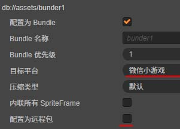
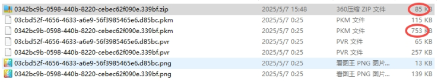

[构建ICfg配置接口](#构建ICfg配置接口)  
[微信打包](#微信打包)  
[微信一键打包](#微信一键打包)  
[打包资源批处理](#打包资源批处理)  
[JSZip接口使用](#JSZip接口使用)  

# 构建ICfg配置接口
vscode runtask `buildTsInterface (构建ICfg.d.ts)`

# 微信打包 
* 项目路径D:\zzqx(盘符任意)`svn://192.168.110.158/zhangxiao/zzqx`
* 0. 启动`zzqx\tools\nodeJsTool\cmd\nginx_start.bat`  

设置remote远程资源必须勾选{r}配置为远程包{!r}  


vscode runtask:

    +-----------+              +----------+
    |1.buildMeta|------------->|2.build_wx|(待完善)
    +-----------+              +----------+
    
    +----------------+
    |3.buildMetaClear|
    +----------------+

* 1.构建meta文件 修改纹理压缩类型  

* 2.微信打包(依赖文件 trunk\client\settings\wechatgame.json)  

   
* 2.0 逆向操作`buildMetaClear`清除纹理压缩配置    
    文件结构:
    ```
        wx--+
            |
            +remote
            |
            +wechatgame
    ```
* 2.1 修改wechatgame\src\settings.js--->server字段`http://192.168.110.177:8001/wx`  

* 2.2 删除相关文件  
删除 wechatgame\assets\tools  
删除 wechatgame\sysdk\wxsdk\index.d.ts  
删除`wechatgame/subpackages/resource/native/55/55091eb9-18f4-4428-a157-c7b9c7cd4942.pem`  
或者执行脚本删除(...)  
删除 wechatgame\project.private.config

* 3.测试代码

wechatgame/game.js

原配置
```js
window["GameVersion"] = "0.0.2";
window["LogVersion"] = "0090";
window["GameType"] = 1;
window["WxTest"] = true;
window["Tank"] = true;
window.boot();
```
修改为
```js
window["GameVersion"] = "0.7.2";
window["WxTest"] = false;
window["CC_PREVIEW"]=true;
```

* 3.1 本地设置:不校验合法域名,...  


* 3.2 Error

```
VM1118 WAGame.js:1 Error: loadFont:fail no permission
    at Proxy.loadFont (gamePage.html:190)
    at Object.Eb (VM1118 WAGame.js:1)
    at C (VM1118 WAGame.js:1)
    at Object.p (VM1118 WAGame.js:1)
    at Object.t [as loadFont] (VM1131 WAGameSubContext.js:1)
    at C (adapter-min.js? [sm]:1)
    at Object.parse (cocos2d-js-min.js:1)
    at cocos2d-js-min.js:1
    at r._flow (cocos2d-js-min.js:1)
    at cocos2d-js-min.js:1(env: Windows,mg,1.06.2303020; lib: 3.8.3)
```

# 微信一键打包

* 1. 修改remote
zzqx\tools\nodeJsTool\cmd\build_wx.bat  
`
node cc_compile.js --w %work% --remote "http://192.168.110.177:8001/zzqx/trunk/client/build/wechatgame/"
`

* 2. vscode runtask `build_wx`  

* 3. 构建目标目录zzqx\trunk\client\build\wechatgame


# 打包资源批处理

* 1. vscode runtask {r}buildMeta{!r}  
    备注 还原使用 vocode runtask {r}buildMetaClear{!r}  
    清理之前请svn 最好提交 assets下的所有文件  

* 2. 按原有流程打包

* 2.1 vscode runtask {r}压缩 build/wechatgame PNG{!r}

* 3. CDN后台开启gzip后缀png pkm pvr(首次操作一次即可)  




# JSZip接口使用
{file}test1/assets/script/binload/JSZipVer.ts@使用JSZip库{!file}
{file}test1/assets/script/binload/JSZipVer.ts@how to use{!file}