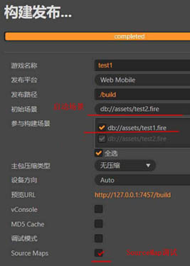
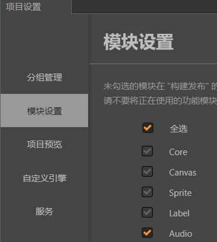
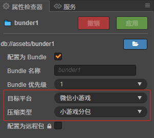

坦克竞赛相关{h}:8001/github/jjqmdlib/entry/doc.html?file=github\cocos2.4.9_project\pahahaha_project.md{!h}

时间戳工具{h}https://tool.lu/timestamp{!h}  

  
[调试端口修改](#调试端口修改)  
[创建Prefab的基本方法](#创建Prefab的基本方法)  
[CocosInspector安装及使用](#CocosInspector安装及使用)  
[组件生命周期](#组件生命周期)  
[工作流程](#工作流程)  
[组件](#组件)  
[常见问题](#常见问题)  
[cocos-cli](#cocos-cli)  
[调试方案](#调试方案)  
[引擎源码](#引擎源码)  
[发布](#发布)  
[命令行编译](#命令行编译)  
[ETC纹理格式](#ETC纹理格式)  
[发布相关](#发布相关)  
[自动化测试](#自动化测试)  
[扩展插件](#扩展插件)  
[引擎接口实现](#引擎接口实现)  
[Editor扩展](#Editor扩展)  
[微信分包设置](#微信分包设置)  
[远程加载资源](#远程加载资源)  

微信开发者{h}https://mp.weixin.qq.com/{!h}  
性能调优{h}https://zhuanlan.zhihu.com/p/297665769{!h}  

官方论坛{h}https://forum.cocos.org/{!h}  
手册文档{h}https://docs.cocos.com/creator/2.4/manual/zh/{!h}  

{h}http://21661rbrw861.vicp.fun{!h}

# 调试端口修改

debugport:  
  
Editor Window--->web pre port-->7457  

{file}test1/settings/project.json{!file}

{file}test1/assets/script/Main.ts@实例化一个预制体{!file}


`size: 750 , 1334`  

# 创建Prefab的基本方法

```

在场景中创建节点结构

在层级管理器中创建或调整节点，形成你想要的Prefab结构

将节点拖拽成Prefab

从层级管理器中将节点拖拽到资源管理器的某个文件夹中

松开鼠标后，你会看到一个新的Prefab资源被创建

通过菜单创建

在层级管理器中选择节点

右键点击选择"创建预制体"或"Create Prefab"

选择保存位置并命名
```


```
所有需要通过动态加载的资源，可以放入 resources 目录下或任何 bundle 文件夹下。bundle 文件夹与 resources 文件夹相似，构建时，bundle 文件夹内的所有资源（包括场景）以及相关的外部资源都会进行打包。加载时可先用 cc.assetManager.loadBundle 加载对应 bundle，之后即可使用 bundle.load 等方法加载 bundle 中的资源。

Bundle 可设置不同的优先级，Creator 内置了 10 个优先级可选择，编辑器构建时将会按照优先级从大到小对 bundle 进行依次构建，当同个资源被不同优先级的多个 bundle 引用时，资源会优先放在优先级高的 bundle 中，低优先级的 bundle 只会存储一条记录信息，此时低优先级的 bundle 会依赖高优先级的 bundle，请在加载低优先级 bundle 之前加载高优先级 bundle；当资源被相同优先级的多个 bundle 引用时，资源会在每个 bundle 中复制一份，此时不同 bundle 没有依赖关系，可用任意顺序加载。所以请尽量让 Texture、SpriteFrame、Audio 等共享的资源放在更高优先级的 bundle，从而让其它 bundle 可共享其资源，减小包体。
```


{h}cocos creator的UI调试{!h}   

# CocosInspector安装及使用
目录: `\github\cc2_4_9\test1\packages\cocos_inspector`  
使用: `Extension->Cocos Inspector->preview Mode`  

# 组件生命周期

    组件创建
    ↓
    onLoad() → (如果激活) → onEnable()
    ↓
    start() (仅在第一次激活前)
    ↓
    循环: update() → lateUpdate()
    ↓
    onDisable() (当组件/节点被禁用)
    ↓
    onDestroy() (当组件/节点被销毁)

```
组件入口函数
1: onLoad: 组件加载的时候调用, 保证了你可以获取到场景中的其他节点，以及节点关联的资源数据;
2: start: 也就是第一次执行 update 之前触发;
3: update(dt):组件每次刷新的时候调用,距离上一次刷新的时间(会在所有画面更新前执行);
4: lateUpdate(dt) 刷新完后调用(会在所有画面更新后执行);
5: onEnable: 启用这个组件的时候调用;
6: onDisable: 禁用这个组件的时候调用;
7: onDestroy: 组件实例销毁的时候调用;
```

# 工作流程
{h}https://docs.cocos.com/creator/2.2/manual/zh/asset-workflow/{!h}

# 组件
BlockInputEvent  
{h}https://docs.cocos.com/creator/2.2/manual/zh/asset-workflow/?q=BlockInputEvent{!h}  
`防止输入穿透到下层节点，一般用于上层 UI 的背景`  

EditBox  
{h}https://docs.cocos.com/creator/2.2/manual/zh/components/editbox.html?h=editbox{!h}  

widget 
{h}https://docs.cocos.com/creator/2.2/manual/zh/components/widget.html?h=widget{!h}  


# 常见问题


https://forum.cocos.org/t/cocoscreator/74555  

关闭perfab自动同步  

`右键显示资源 UUID和路径`  

自定义模板  
{h}https://docs.cocos.com/creator/2.4/manual/zh/publish/custom-project-build-template.html{!h}  

资源释放  
{h}https://blog.csdn.net/weixin_30853033/article/details/112437437{!h}  

`Web 平台构建`  
C:\ProgramData\cocos\editors\Creator\2.4.9\CocosCreator.exe --build D:\github\cc2_4_9\test1 --platform web

--path projectPath --build "platform=android;debug=true"

C:\ProgramData\cocos\editors\Creator\2.4.9\CocosCreator.exe -path D:\github\cc2_4_9\test1 --build "platform=web;debug=true"

`Android 平台构建`  
cocos creator --build "path/to/project" --platform android

加载内置-asset-bundle {h}https://docs.cocos.com/creator/2.4/manual/zh/asset-manager/bundle.html#加载内置-asset-bundle{!h}  

内存回收 {h}https://blog.csdn.net/weixin_43191835/article/details/144450117{!h}  


    内置 Asset Bundle	功能说明	配置

    internal	存放所有内置资源以及其依赖资源	通过配置 资源管理器 中的 internal -> 
    
    resources 文件夹，但目前不支持修改默认配置
    
    main	存放所有在 构建发布 面板的 参与构建场景 中勾选的场景以及其依赖资源	通过配置 构建发布 面板的 主包压缩类型 和 配置主包为远程包 两项
    
    resources	存放 resources 目录下的所有资源以及其依赖资源	通过配置 资源管理器 中的 assets -> resources 文件夹
    
    start-scene	如果在 构建发布 面板中勾选了 初始场景分包，则首场景将会被构建到 start-scene 中。具体内容可参考 初始场景的资源加载。	无法进行配置

常用菜单:  
* 布局/恢复默认布局  

`扩展插件`-------编译引擎即可刷新  

`微信入口代码位置`  
`cocos2.4.9_project\test1\build\wechatgame\assets\main\index.js`  

{r}使用自定义的js库{!r}  

在bunder中异步加载
```js
class TestLib{
    constructor(){
        console.log(`TestLib constructor...`);
    }
}
window['TestLib'] = TestLib;
```

{r}preview-templates模板设置{!r}  

将`C:\ProgramData\cocos\editors\Creator\2.4.9\resources\templates\preview-template\preview-templates`  
放置到`mygitblit\cocos2.4.9_project\test1\preview-templates`的目录下  

    project-folder
    |--assets
    |--build
    |--preview-templates


{r}cocos creator原生编辑器卡顿解决方案{!r}  
`console中打印日志,之后断点调试`  


# cocos-cli  
{h}https://www.npmjs.com/package/cocos-cli{!h}  

npm i cocos-cli  

`npm install -g cocos-creator-global-cli`

# 调试方案

```
Cocos Creator 中的 setSiblingIndex 方法
setSiblingIndex 是 Cocos Creator 中用于设置节点在其父节点的子节点列表中位置的方法。这个方法可以改变节点在兄弟节点中的层级顺序，从而影响渲染顺序和事件处理顺序。
```

# 引擎源码

`C:\ProgramData\cocos\editors\Creator\2.4.9\resources\engine`

{h}https://docs.cocos.com/creator/2.4/manual/zh/advanced-topics/engine-customization.html#_1-1-获取-js-引擎{!h}


```

    # 在命令行中进入引擎路径
    cd E:/engine
    # 安装 gulp 构建工具
    npm install -g gulp
    
    # 安装依赖的模块
    npm install
```

编译引擎
```cmd
D:\mygitblit\engine>gulp build-dev
```


关掉引擎再发布

# 发布
  
勾选项目中的依赖库文件  
  

{h}http://127.0.0.1:8001/github/cc2_4_9/test1/build/web-mobile/index.html{!h}

cmd发布---> map source 调试  

    主逻辑代码(业务层代码块)
    test1\build\web-mobile\assets\main\index.js  
    test1\build\web-mobile\assets\main\index.js.map  

# 命令行编译  

{file}cmd\compile.bat{!file}

{h}https://docs.cocos.com/creator/2.4/manual/zh/publish/publish-in-command-line.html#命令行发布参考{!h}

受编辑器设置影响,比如构建发布中设置只构建脚本,那么命令行就只构建脚本  


`test1\settings\builder.json`


`bd27fae3-0079-4301-a2ad-bad41d568fa5 (bdJ/rjAHlDAaKtutQdVo+l), db://assets/test1.fire`
`caf42390-5dd1-47a9-a2c0-675a9720f460 (ca9COQXdFHqaLAZ1qXIPRg), db://assets/test2.fire`


{r}禁用Hash资源{!r}  

build.json
```
{
  "md5Cache": false
}
```
方法1:  
`creator --project /path/to/project --build "platform=web-mobile;md5Cache=false"`  

方法2:
```
找到 cocos2d/core/CCAssetManager.js 文件
修改 _getUrlWithUuid 方法，使其不添加 hash
```

cc.loader._cache

GitBlit  
https://blog.csdn.net/along1990q/article/details/139469842  
https://blog.csdn.net/m0_37383484/article/details/137923674  


# ETC纹理格式

压缩纹理  
{h}https://docs.cocos.com/creator/2.4/manual/zh/asset-workflow/compress-texture.html{!h}  

C:\Program Files (x86)\Tencent\微信web开发者工具\

"appid": "wxbca72f7c8bf7c7a8",  


97c38d55-ecdd-4b63-aea9-e965aadc7e4d.pkm


引擎源码

编辑器设置`文件/设置/Javascript引擎路径`  
```
C:/ProgramData/cocos/editors/Creator/2.4.9/resources/engine/cocos2d/core
```

`http://127.0.0.1:8001/mygitblit/cocos2.4.9_project/build1/web-mobile/`  

`C:/ProgramData/cocos/editors/Creator/2.4.9/resources/engine/cocos2d/core/asset-manager/load.js`  

line: 10539 `      load: function load(paths, type, onProgress, onComplete) {`  

line: 11682
`      download: function download(id, url, type, options, onComplete) {` 


纹理类型枚举  

cc.Texture2D.PixelFormat

    {
    "RGB565":12,
    "RGB5A1":13,
    "RGBA4444":14,
    "RGB888":15,
    "RGBA8888":16,
    "RGBA32F":20,
    "A8":9,
    "I8":10,
    "AI8":11,
    "RGB_PVRTC_2BPPV1":5,
    "RGBA_PVRTC_2BPPV1":6,
    "RGB_A_PVRTC_2BPPV1":1024,
    "RGB_PVRTC_4BPPV1":7,
    "RGBA_PVRTC_4BPPV1":8,
    "RGB_A_PVRTC_4BPPV1":1025,
    "RGB_ETC1":4,       //无透明通道
    "RGBA_ETC1":1026,   //有透明通道的
    "RGB_ETC2":28,
    "RGBA_ETC2":29
    }

-----------------------------------------
# 发布相关
    +--------------------------------------------------+
    |                   发布相关                        |
    +--------------------------------------------------+

\mygitblit\cocos2.4.9_project\test1\settings\wechatgame.json
```
{
  "appid": "wx0afcbc002849ed63",
  "orientation": "portrait",
  "separate_engine": true,
  "REMOTE_SERVER_ROOT": "http://127.0.0.1:8001/mygitblit/cocos2.4.9_project/build1/res/",
  "subContext": "",
  "startSceneAssetBundle": false
}
```

REMOTE_SERVER_ROOT 资源服务器

输出的微信目录为:
\mygitblit\cocos2.4.9_project\build1\wechatgame\src\settings.js  
```json
window._CCSettings = {
    platform: "wechatgame",
    groupList: [
        "default"
    ],
    collisionMatrix: [
        [
            true
        ]
    ],
    hasResourcesBundle: false,
    hasStartSceneBundle: false,
    remoteBundles: [
        "main"
    ],
    subpackages: [],
    launchScene: "db://assets/test3.fire",
    orientation: "",
    server: "http://192.168.110.183:8001/mygitblit/cocos2.4.9_project/build1/res/",
    debug: true,
    jsList: []
};

```
server为资源服务器

构建文档{h}https://chat.deepseek.com/a/chat/s/5976f816-7562-4e29-b79a-80c5f98b333b{!h}  

```
[Creator安装目录]/resources/engine/bin/creator/build
```

{r}平台适配{!r}C:\ProgramData\cocos\editors\Creator\2.4.9\resources\builtin\adapters\platforms

引导 CCDirector.js  

扩展包:`https://docs.cocos.com/creator/2.4/manual/zh/extension/your-first-extension.html`  

定制构建信息:`https://docs.cocos.com/creator/2.4/manual/zh/publish/custom-project-build-template.html`  

Ctrl + F7 `编译引擎`  

API文档  
{h}https://docs.cocos.com/creator/2.4/api/zh/enums/Texture2D.PixelFormat.html{!h}

# 自动化测试

{h}https://developers.weixin.qq.com/miniprogram/dev/devtools/minitest/autotest.html{!h}  


http://192.168.110.183:8001/zzqx/trunk/wx/  

打包机{h}http://192.168.110.118:7457/{!h}  


`https://zzqxres-tt.wanhuir.com/reskaifa`

USER-20250417AX 1~6a

# 扩展插件
{h}https://docs.cocos.com/creator/2.4/manual/zh/extension/your-first-extension.html{!h}  

    MyProject
    |--assets
    |--packages
        |--cust_build1
            |--package.json
            |--main.js


{file}test1\packages\cust_build1\package.json{!file}
{file}test1\packages\cust_build1\main.js{!file}


注意:如何是插件生效  
* 重启编辑器  
* 或 点击菜单 开发者/刷新编辑器

常用路径
{h}https://docs.cocos.com/creator/2.4/manual/zh/extension/working-directory.html{!h}  

插件目录转化  
`Editor.url('packages://')`


常用变量

    Editor.Project.path（主进程）当前在编辑器打开项目的根目录绝对路径。


# 引擎接口实现
{r}schedule{!r}
```js
engine\cocos2d\core\components\CCComponent.js
line 559
schedule (callback, interval, repeat, delay) {
  /**
     * !#en
     * Schedules a custom selector.<br/>
     * If the selector is already scheduled, then the interval parameter will be updated without scheduling it again.
     * !#zh
     * 调度一个自定义的回调函数。<br/>
     * 如果回调函数已调度，那么将不会重复调度它，只会更新时间间隔参数。
     * @method schedule
     * @param {function} callback The callback function
     * @param {Number} [interval=0]  Tick interval in seconds. 0 means tick every frame.
     * @param {Number} [repeat=cc.macro.REPEAT_FOREVER]    The selector will be executed (repeat + 1) times, you can use cc.macro.REPEAT_FOREVER for tick infinitely.
     * @param {Number} [delay=0]     The amount of time that the first tick will wait before execution. Unit: s
     * @example
     * var timeCallback = function (dt) {
     *   cc.log("time: " + dt);
     * }
     * this.schedule(timeCallback, 1);
     */
    schedule (callback, interval, repeat, delay) {
        cc.assertID(callback, 1619);

        interval = interval || 0;
        cc.assertID(interval >= 0, 1620);

        repeat = isNaN(repeat) ? cc.macro.REPEAT_FOREVER : repeat;
        delay = delay || 0;

        var scheduler = cc.director.getScheduler();

        // should not use enabledInHierarchy to judge whether paused,
        // because enabledInHierarchy is assigned after onEnable.
        // Actually, if not yet scheduled, resumeTarget/pauseTarget has no effect on component,
        // therefore there is no way to guarantee the paused state other than isTargetPaused.
        var paused = scheduler.isTargetPaused(this);

        scheduler.schedule(callback, this, interval, repeat, delay, paused);
    },

```

获取可见区域高度  
`cc.view.getVisibleSize().height`  

转化为全局坐标  
 `target.convertToWorldSpaceAR(cc.v3())`  

# Editor扩展

# 微信分包设置


# 远程加载资源
```ts
const remoteUrl = "https://example.com/image.png";
cc.assetManager.loadRemote<cc.Texture2D>(remoteUrl, (err, texture) => {
    if (err) {
        console.error("加载失败:", err);
        return;
    }
    // 创建 SpriteFrame 并应用到 Sprite 组件
    const spriteFrame = new cc.SpriteFrame(texture);
    this.node.getComponent(cc.Sprite).spriteFrame = spriteFrame;
});
```